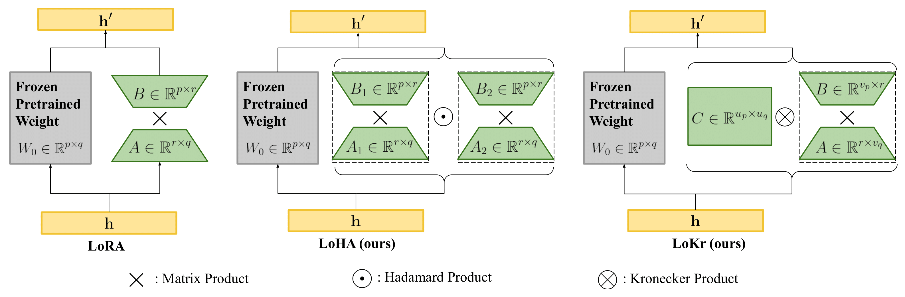
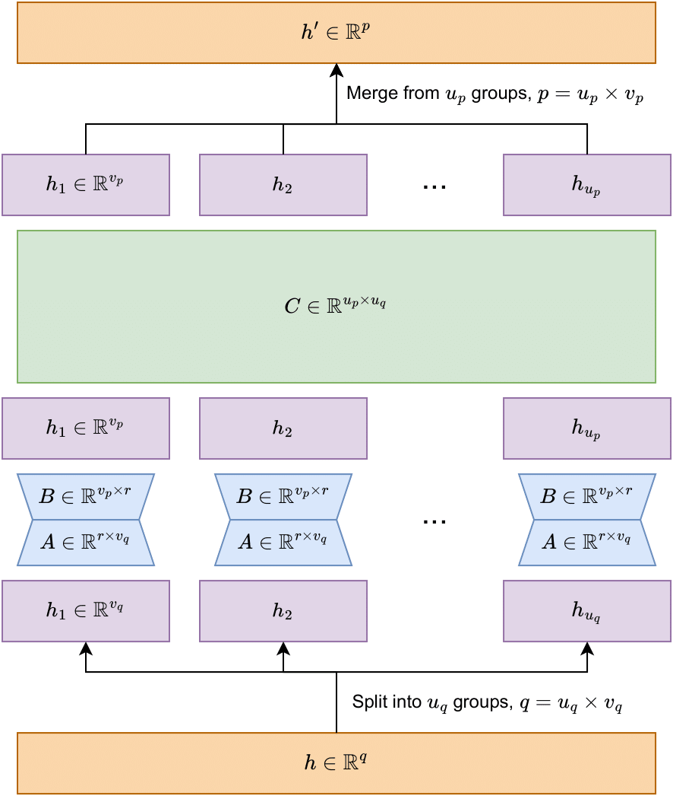

# Algorithm explanation

## Basic Idea

Linear Layer

$Y = W \cdot X$

We fine-tune to get $W'=W+\Delta W$

$Y = W' \cdot X = W \cdot X + \Delta W \cdot X$

LoRA-type methods focus on how we decompose $\Delta W$

($Y$ and $X$ are respectively $h'$ and $h$ in the above figure)

## From LoRA to LoCon

### LoRA for linear layers

$Y_{out \times batch} = W_{out \times in} \cdot X_{in \times batch}$

$\xrightarrow{} Y_{out \times batch} = W_{out \times in} \cdot X_{in \times batch} + B_{out \times dim} \cdot A_{dim \times in} \cdot X_{in \times batch}$

--

### LoRA for convolution

Consider im2col of matmul first:

$X:[channel, width, height]\xrightarrow{reorder}[c \times kw \times kh, outw \times outh]$

$Kernels: [out, c, kw, kh] \xrightarrow{reshape} [out, c \times kw \times kh]$

$Conv(X, Kernels) = Kernels  \times  X \xrightarrow{reshape} [out, outw, outh]$

and then write down this conventional LoRA for conv layer

$Conv(in, out, ksize, padding, stride)\xrightarrow{}Conv(dim, out, 1)\circ Conv(in, dim, ksize, padding, stride)$

In this method, we can get that
$\Delta W = B \cdot A$ with $rank(\Delta W) \le dim$

--

### LoRA for convolution with Tucker decomposition

Triggered by `use_tucker=True`

As mentioned above, the weight shape for convolution layer is $[out, in, kw, kh]$, and we just unfold it to $[out, in \times kw \times kh]$ for decomposition.

But actually there is a method to decompose any shape of tensor more efficiently called [Tucker decomposition](https://en.wikipedia.org/wiki/Tucker_decomposition).

Using Tucker decomposition in Covolution will give something like (with $\times_n$ representing n-mode product):

$\tau: [dim, dim, kw, kh]$  
$x_1: [dim, out]$ 
$x_2: [dim, in]$ 
$W' = \tau \times_1 x_1 \times_2 x_2$ 
$W': [out, in, kw, kh]$

Or write this thing as multiple conv layer:

Conv(in, dim, (1, 1)) 
↓ 
Conv(dim, dim, (kw, kh), stride, padding) 
↓ 
conv(dim, out, (1, 1)) 

For hadamard product implementation, just use 2 different $W'$ and multiply them together.

## LoHa

Image from [FedPara](https://arxiv.org/abs/2108.06098)

Consider $\Delta W = B \odot A$. We have $rank(\Delta W) \le rank(B) \times rank(A)$.
We then use conventional method on $B$ and $A$, which means it can use 2x dim to get square rank.

**Rank != Information capacity, but they may be related**

Based on the experiment result from the paper, it seems like although $rank(B) * rank(A)$ is just an upper bound, almost everytime it will produce $\Delta W$ with $rank(\Delta W) = rank(B)*rank(A)$.

### Why custom backward
With $\Delta W = (B_1 \cdot B_2) \odot (A_1 \cdot A_2)$, when you need to compute the backpropogation, you will need $\nabla_{\Delta W}$ and $A$ to compute $\nabla_B$, and $\nabla_{\Delta W}$ and $B$ to compute $\nabla_A$.

With pytorch's autograd, this kind of operation will cache both $B$ and $A$ for computing the backward, which means it will cache 2x size of weight for backward.

To avoid this terrible situation, LyCORIS implements a custom backward which will reconstruct $B$ and $A$ when actually needed, this method saved tons of memory.

## LoKr

### Kronercker Product

If $W_1$ is an $a \times b$ matrix and $W_2$ is a $c \times d$ matrix, then the Kronecker roduct of two matrices $W' = W_1 \otimes W_2$ is an $ac \times bd$ matrix.

In meaning of matrix, $W_2$ becomes weight and $W_1$ becomes weight scale of $W_2$

### About rank

And we can decompose $W_2$ using LoRA with rank  $r$.

$W_2 = Wa_2 \cdot Wb_2$ then $\Delta W = W_1 \otimes (Wa_2 \cdot Wb_2)$

We get $rank(\Delta W) \le rank(W_1) \times rank(Wa_2 \cdot Wb_2)$, $rank(W_1) \le min(a, b)$, and $rank(Wa_2 \cdot Wb_2) \le r$ 

=> $rank(W') \le min(a, b) \times r$

Put it simply, rank is mutiplicative under Kronecker product.

### Number of parameters

We decompose matrix, $\Delta W = W_1 \otimes (Wa_2 \cdot Wb_2) \in \mathbb{R}^{p\times q}$, with $p = ac$, $q = bd$

(# of parameters) = $(a \times b) + (c \times r + r \times d) = a \times b + r \times (c + d)$

When factor is set to -1, we roughly have $a=c= \sqrt{m}$ and $b=d= \sqrt{n}$

then, (# of parameters) = $\sqrt{mn} + r \times (\sqrt{m} + \sqrt{n})$

We can reduce the number of parameters to the order of square root of matrix width/height if we further decompose $W_1$

### As a sequence of linear layers

  

## Sparse Bias
Todo...
